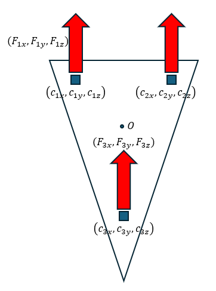

## **Optimal Ankle Compliance Regulation for Humanoid Balancing Control**

**Authors**: Mohamad Mosadeghzad, Zhibin Li, Nikos G. Tsagarakis, Gustavo A. Medrano-Cerda, Houman Dallali, and Darwin G. Caldwell

### **1. Intro**
최적의 제어 전략을 사용하여 휴머노이드를 밸런싱하기 위한 유효 발목 임피던스 프로파일을 생성하는 방법에 대하여 다룬다.

#### **COP란?**
COP는 Center of pressure로, 접지 surface에 작용하는 모든 힘의 **평균적인** 작용점을 의미한다.

이 개념을 쓰는 이유는, 로봇의 발 또는 다른 접촉 부위가 지면에 힘을 가할 때, 이 힘의 분포가 일정하지 않고,
따라서 이 힘들의 평균적인 작용점이 로봇의 균형 또는 안정성을 평가하는 데 중요하게 작용하기 때문이다.

정의에 따르면, CoP는 다음과 같이 구할 수 있다. (2d plane 기준)

$$ \mathbf{r}_{cop} = \frac{\int{\mathbf{r} \cdot dF}}{F} $$

CoP는 이어서 설명할 ZMP와 밀접한 관련이 있다.

#### **ZMP란?**
ZMP는 Zero Moment Point로, 로봇이 지면이 접촉할 때, 지면에서 발생하는 모든 모먼트가 0이 되는 지점을 말한다.

실제로 로봇의 밸런싱을 평가할 때 사용되는 개념은 ZMP이며, 일반적으로 휴머노이드 같은 로봇들은 desired ZMP를 추종하도록 제어된다. 이에 대해 좀 더 자세히 알아보도록 하자.

##### **2D space**
2차원 공간에서는 contact surface에서의 force의 성분이 두 개(f_x, f_z)만 존재하고, f_x는 x축 위에 존재하여 모먼트 합에서 제외된다.
f_z는 단위 길이당 force, 즉 pressure라고 생각할 수 있고, 따라서 ZMP는 곧 CoP가 된다.

{: width="200"}

또한, 일반적으로 GRF는 항상 0보다 크거나 같으므로, ZMP는 항상 support polygon 내부에 존재하게 된다.(Definition of CoP + Mean Value Theorem)

> 이건 정적인 상황을 가정한 결과이다.

그러나, ZMP가 support polygon의 경계에 가까워지면, 약간의 외부 disturbance만으로도 해당 경계를 기준으로 body가 회전할 수 있다.

따라서, ZMP가 support polygon 내부에서 약간의 margin을 가진 채로 존재하는 것이 이상적이다.

##### **3D space**
3차원 공간에서는 보다 복잡하다. 먼저 공간에서의 모먼트는 vertical force에 의한 moment와, horizontal force에 의한 moement로 나눌 수 있는데, 따라서 점 p에서의 모먼트 합은 다음과 같이 표현할 수 있다.

$$ \tau_{p} = \tau_{n}(p) + \tau_t(p)$$

###### **(1) tau_n(p)**
vertical GRF에 의해 생성된 torque는 다음과 같이 나타낼 수 있다. 이때, w는 단위 면적당 힘을 나타낸다.

$$ \mathbf{\tau}_n(\mathbf{p}) \equiv [\tau_{nx} \, \tau_{ny} \, 0]^T \,\, where, $$

$$\tau_{nx} = \int_S{(y-p_y)w(x, y)dS}$$

$$\tau_{ny} = \int_S{(x-p_x)w(x, y)dS}$$

우리는 위 토크 성분을 0으로 만드는 (p_x, p_y)가 필요하므로, 정리하면

$$ p_x = \frac{\int_Sxw(x,y)dS}{\int_Sw(x,y)dS} $$

$$ p_y = \frac{\int_Syw(x,y)dS}{\int_Sw(x,y)dS} $$

단위 면적당 vertical force는 곧 surface에서 가해지는 압력과 같으므로, 우리는 이러한 점 p가 CoP, 즉 ZMP임을 알 수 있다.

###### **(2) tau_t(p)**
horizontal GRF에 의해 생성된 torque는 다음과 같이 나타낼 수 있다. 이때, σ_x와 σ_y는 각각 단위 면적 당 힘을 나타낸다.

$$ \mathbf{\tau}_n(\mathbf{p}) \equiv [0 \, 0 \, \tau_{tz}]^T \,\, where, $$

$$\tau_{tz} = \int_S{\{(x-p_x)\sigma_y(x, y) - (y-p_y)\sigma_x(x, y)\}dS}$$

따라서, ZMP $$ p $$ 에 대하여, surface에 가해지는 여러 힘과 모먼트를 하나로 나타낼 수 있다.

$$ \mathbf{f} = [f_x \, f_y \, f_z] \,\, where,$$

$$ f_x = \int_S\sigma_x(x, y)dS \,, f_y = \int_S\sigma_y(x, y)dS \,, f_z = \int_Sw(x,y)dS $$

$$ \mathbf{\tau}_p = \mathbf{\tau}_n(\mathbf{p}) + \mathbf{\tau}_t(\mathbf{p}) = [0 \, 0 \, \tau_{tz}]^T$$

위 식을 바탕으로, 3D 공간에서의 ZMP는 모먼트의 모든 요소가 0이 되는 지점이 아니라,
GRF로 인한 모먼트 성분 중 horizontal 요소만 0이 되는 지점으로 정의되어야 한다는 것을 알 수 있다.

2D 공간에서 ZMP가 항상 support polygon 내부에 존재한다는 것을 보였던 것과 마찬가지로, 3D 공간에서도 이를 증명할 수 있다.

그러나 이를 증명하기 위해서는 convex hull의 정의를 이용한 support polygon의 개념 또한 필요하기 때문에, 그냥 3D 공간에서도 ZMP는 항상 support polygon 내부에 존재하는구나.. 정도만 알고 넘어가도록 하자.

그러나 practical하게, 접촉면의 모든 부위에서의 가해지는 힘을 알 수는 없다. 따라서, 실제로 COP를 측정하기 위해서는 특정 몇몇 지점에서 가해지는 힘 만을 가지고 계산해야 한다. (특정 지점 힘 센서 설치 -> 모델 기반 COP 계산 및 자세 제어 -> 피드백)

예를 들어보자.

{: width="200"}

위와 같은 세모난 발바닥에 세 개의 force sensor가 달려 있다고 생각하면,

$$ F_{1,x}+F_{2,x}+F_{3,x}=GRF_x $$

$$ F_{1,y}+F_{2,y}+F_{3,y}=GRF_y $$

$$ F_{1,z}+F_{2,z}+F_{3,z}=GRF_z $$

$$ \mathbf{GRF} = [GRF_x, GRF_y, GRF_z]^T $$

그리고, local frame 기준, COP position은 다음과 같이 둔다.

$$ \mathbf{r}_{cop} = (CoP_x, CoP_y, 0) $$

CoP의 정의로부터, 원점 O 기준 GRF와 CoP의 관계는 다음과 같다. (O에서의 모먼트 합)

$$ \mathbf{M_O} = \sum{\mathbf{M}_i} = \sum{\mathbf{c}_i \times \mathbf{F}_i} = \mathbf{r}_{cop} \times \mathbf{GRF} + \mathbf{\tau_n} \left(\mathbf{\tau_n} = [0\,0\,T_z]^T\right) $$

T_z는 정리하면 다음과 같다.

$$ T_z = -CoP_x \cdot GRF_y + CoP_x \cdot GRF_x + \sum{(c_{ix} \cdot F_{iy} - c_{iy} \cdot F_{ix})} $$

...
어쩌다 보니 논문 리뷰는 안하고 CoP와 ZMP에 대해서만 쓰게 됐는데, 나중에 다시 정리해야 할 것 같다......

다음 posting에서는 그래서 ZMP가 로봇의 밸런싱에 어떻게 구체적으로 작용하는지, 그리고 body에 가속도가 붙은 동적인 상황에서는 어떻게 로봇의 밸런싱을 평가해야 하는지 다뤄보겠다.

아마도 포스팅의 제목을 바꿔야 할 듯 싶다....